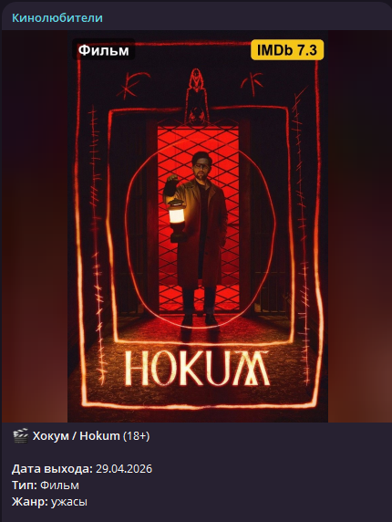
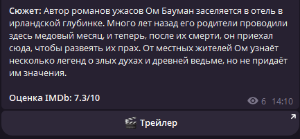
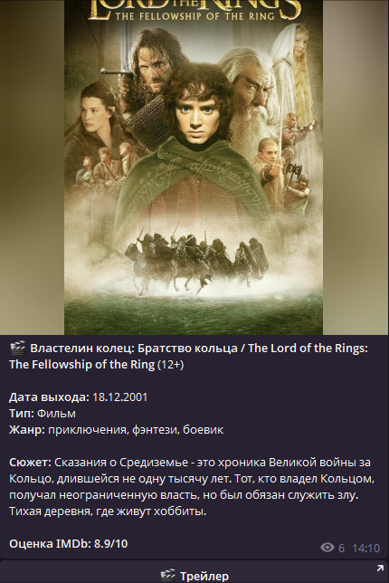

# Telegram bot for random movie posts

Бот принимает список названий фильмов/сериалов/аниме в столбик, берет данные из TMDb и OMDb, накладывает тип на постер и публикует случайный элемент вручную или по расписанию.

## 📸 Скриншоты






## Запуск

1. Создайте виртуальное окружение и установите зависимости:

```powershell
python -m venv .venv
.\.venv\Scripts\Activate.ps1
pip install -r requirements.txt
```

2. Создайте `.env` рядом с `main.py`:

```powershell
Copy-Item .env.example .env
```

3. Заполните `TELEGRAM_BOT_TOKEN`.

4. Запустите:

```powershell
python main.py
```

Если `ADMIN_IDS` не указан, первый пользователь, который отправит `/start`, станет администратором.

## Что умеет бот

- загрузка списка из текста, `.txt`, `.csv`, `.xlsx`;
- меню API-ключей для Groq, Gemini, TMDb, OMDb;
- публикация в группы, каналы и темы по `@username`, `https://t.me/name`, `https://t.me/c/3988076227/305` или числовому `chat_id`;
- расписание кнопками: 5 мин, 10 мин, 30 мин, 1 час, 2 часа, 3 часа;
- случайная публикация без повторов, пока список не закончится;
- сброс истории публикаций отдельной кнопкой;
- генерация постера с мини-блоком справа сверху и надписью вида `IMDb 7.8`;
- публикация отменяется, если IMDb/OMDb не вернул данные или рейтинг;
- управление ботом работает только в личных сообщениях администратора, команды в группах и каналах игнорируются;
- настройка размера/позиции прозрачного блока и размера/позиции/цвета текста типа.

## Важно

Бот должен быть добавлен в канал или группу и иметь право отправлять сообщения. Для приватных каналов лучше добавлять бота администратором.
